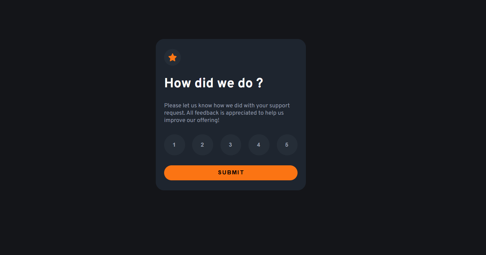
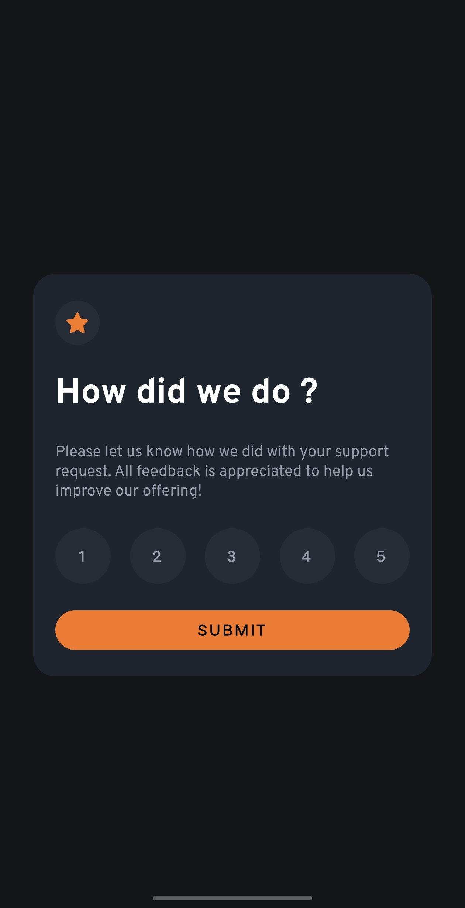

# Frontend Mentor - Interactive rating component solution

This is my solution to the [Interactive rating component challenge on Frontend Mentor](https://www.frontendmentor.io/challenges/interactive-rating-component-koxpeBUmI).

## Table of contents

- [Frontend Mentor - Interactive rating component solution](#frontend-mentor---interactive-rating-component-solution)
  - [Table of contents](#table-of-contents)
  - [Overview](#overview)
    - [The challenge](#the-challenge)
    - [Screenshot](#screenshot)
      - [Desktop View](#desktop-view)
      - [Mobile View](#mobile-view)
    - [Links](#links)
  - [My process](#my-process)
    - [Built with](#built-with)
    - [What I learned](#what-i-learned)

## Overview

### The challenge

Users should be able to:

- View the optimal layout for the app depending on their device's screen size
- See hover states for all interactive elements on the page
- Select and submit a number rating
- See the "Thank you" card state after submitting a rating

### Screenshot

| Desktop | Mobile |
| :---: | :---: |
|  |  |

### Links

- Solution URL: [View Solution](https://github.com/golu-dhama/Interactive-rating-component)
- Live Site URL: [View Live Site](https://golu-dhama.github.io/Interactive-rating-component/)

## My process

### Built with

- Semantic HTML5 markup
- CSS custom properties
- Flexbox
- CSS positioning
- JavaScript
- Mobile-first workflow

### What I learned

This project helped me understand how to approach a frontend project from a design rather than directly writing CSS.

Some of the main concepts I practiced were:

- Breaking a UI into meaningful HTML structures
- Using semantic HTML elements based on content and purpose
- Using Flexbox for component layout
- Understanding `width: 100%` together with `max-width`
- Using `padding` for internal spacing and `gap` for spacing between flex children
- Creating circular rating buttons using equal `width` and `height` with `border-radius`
- Creating hover and selected states
- Understanding the difference between CSS pseudo-classes such as `:hover` and a JavaScript-controlled `.selected` class
- Using `position: absolute` with a positioned parent to place the thank-you state over the rating state
- Managing UI state with JavaScript
- Updating content dynamically using `textContent`

For example, the selected rating is stored in JavaScript:

```js
let currentRating = null;

currentRating = button.textContent;
```

